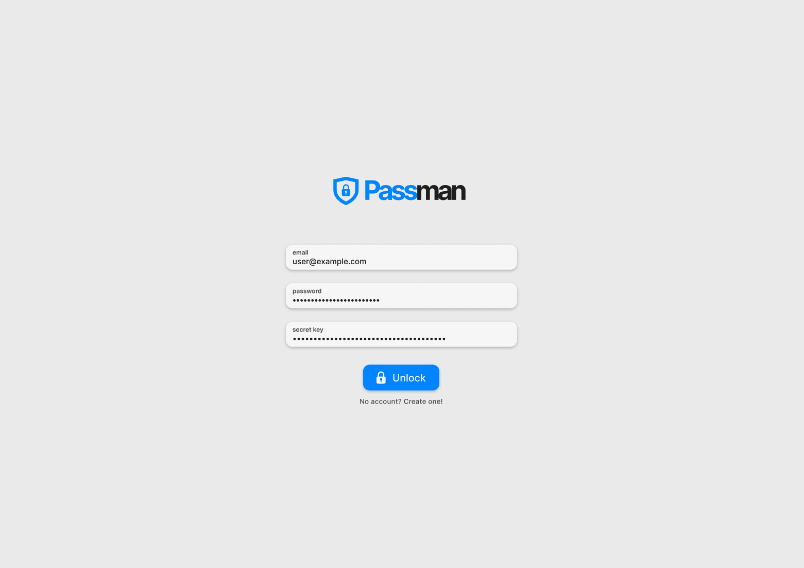
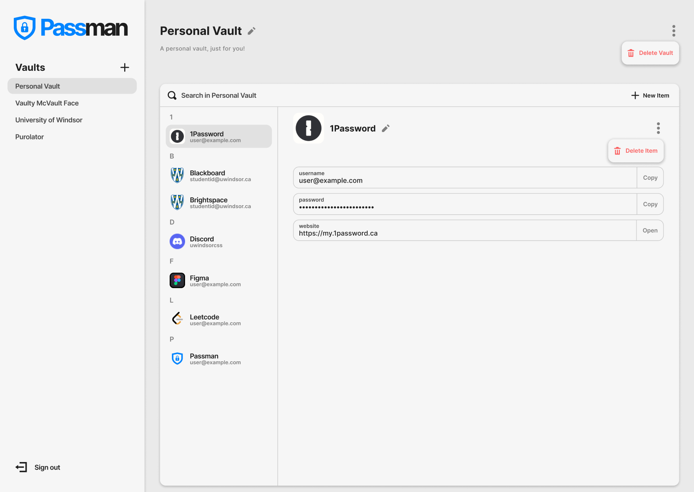

# COMP 3340 Passman

This repository is the working tree of Connor Horman and Isaac Kilbourne's (Group 1) password manager for COMP 3340.

Passman is an end-to-end encrypted password manager that uses zero-knowledge proofs and modern cryptography to ensure that a user - and only that user - is able to view their stored credentials. Nobody else, not even the servers that run Passman, are ever in possession of sufficient information to decrypt any user's data.

The following are screenshots of Passman:

**Signing In**:

**Signed In**:

## Part 1 - Reading List

The first part of the project is to find at least 10 reputable publications that will inform our design and implementation decisions.

The following publications were chosen, in no particular order:

1. [PBKDF2 NIST Publication](https://nvlpubs.nist.gov/nistpubs/Legacy/SP/nistspecialpublication800-132.pdf)
2. [1Password Whitepaper](https://1passwordstatic.com/files/security/1password-white-paper.pdf)
3. [Keccack Implementation Overview](https://keccak.team/files/Keccak-implementation-3.2.pdf)
4. [Security Analysis of Password Managers](https://www.usenix.org/system/files/conference/usenixsecurity14/sec14-paper-li-zhiwei.pdf)
5. [Time-based OTP authentication via secure tunnel (TOAST): A mobile TOTP scheme using TLS seed exchange and encrypted offline keystore](https://ieeexplore.ieee.org/abstract/document/6920371)
6. [Announcing the Advanced Encryption Standard](https://nvlpubs.nist.gov/nistpubs/FIPS/NIST.FIPS.197.pdf)
7. [Curve25519: New Diffie-Hellmen Speed Records](https://link.springer.com/chapter/10.1007/11745853_14)
8. [Web API Verification: Results and Challenges](http://static.cs.brown.edu/~sk/Publications/Papers/Published/glpk-web-api-verif-short/paper.pdf)
9. [Persistence of Passwords in Bitwarden’s Browser Extension: Unnecessary Retention and Solutions](https://passcert-project.github.io/publication/2022/rafael-prates-thesis/2022_IST_MSc_Thesis_RafaelPrates.pdf)
10. [UC-339 Cybersecurity Analysis of Password Managers](https://digitalcommons.kennesaw.edu/cday/Spring_2023/Undergraduate_Capstone/10/)

## Part 2 - Critical Summary

See [Critical Summary.md](./Critical%20Summary.md)

## Part 3 - Build It!

Good news - you're in the right place :) This repo contains the complete source code for PassMan.
